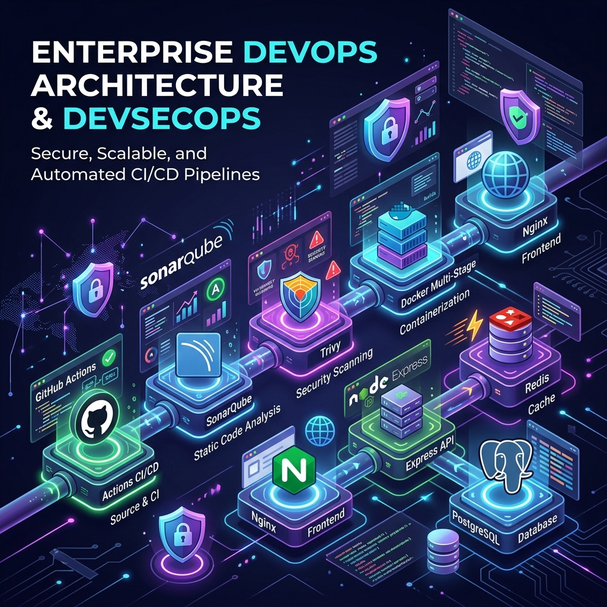

# Enterprise DevOps & DevSecOps Architecture



تطبيق ويب متكامل مصمم وفق أحدث معايير **DevOps** و **DevSecOps** للمؤسسات. يشتمل المشروع على بنية تحتية مؤتمتة بالكامل، خطوط بناء ونشر مستمرة (CI/CD)، فحص الأمان وفحص الجودة البرمجية والتأكد من خلو المشروع من ثغرات الحماية.

---

## 🛡️ أبرز إنجازات DevSecOps & Security Hardening

- **خط بناء ونشر مؤتمت (GitHub Actions CI/CD)**: خطوط عمل مؤتمتة بالتوازي تضمن بناء واختبار كافة مكونات النظام.
- **تثبيت التبعيات الأمنية (Action Pinning)**: تثبيت كافة أفعال GitHub Actions بإصدارات محددة لمنع هجمات سلاسل التوريد (Supply Chain Attacks).
- **تحليل الكود الساكن (SonarQube Analysis)**: فحص شامل وجودة كود عالية 100% مع حل جميع الملاحظات والـ Security Hotspots.
- **فحص الثغرات الأمنية (Trivy Security Scanning)**: فحص أمني آلي للملفات وملفات Docker والحزم لمعالجة ثغرات النظام والحزم قبل النشر.
- **حماية الحاويات (Docker Hardening)**:
  - استخدام بنية المكونات متعددة المراحل (Multi-stage builds) لتقليل حجم الصور.
  - تشغيل الخدمات بمستخدمين غير متميزين (Unprivileged `USER node`).
  - إيقاف تشغيل سكريبتات دورة الحياة أثناء تثبيت الحزم (`npm ci --ignore-scripts`).
  - نسخ الملفات المحددة بدقة لتجنب تسريب أي ملفات حساسة.
- **حماية خادم Web & Express**:
  - تعطيل رؤوس كشف تكنولوجيا الخادم (`app.disable('x-powered-by')`).
  - حماية الأصول الأمامية باستخدام سلامة الموارد المتقاطعة (**Subresource Integrity - SRI**).
  - التوافق مع معايير الوصول الشامل والتباين البصري (**WCAG AA Contrast Compliance**).

---

## 🏗️ البنية التحتية والتقنيات المستخدمة

- **الواجهة الأمامية (Frontend)**: Nginx (Alpine-Slim) + HTML5 / CSS3 (Glassmorphism UI) + Vanilla JavaScript (RTL).
- **الخلفية (Backend API)**: Node.js 20 + Express.js + RESTful APIs.
- **قواعد البيانات والتخزين المؤقت**:
  - **PostgreSQL**: لتخزين بيانات المستخدمين بشكل دائم.
  - **Redis**: لتخزين عداد الزيارات التفاعلي وإدارته بسرعة فائقة.
  - **Memory Fallback Mode**: نمط احتياطي تلقائي يضمن استمرار عمل التطبيق في الذاكرة في حال انقطاع الاتصال بقواعد البيانات دون انهيار الخادم.
- **الأتمتة والبيئة التحتية كرمز (IaC & Configuration Management)**:
  - **Docker & Docker Compose**: بيئات تطوير وإنتاج معزولة.
  - **Terraform**: لإدارة البنية التحتية السحابية على AWS (VPC, Subnets, Security Groups, EC2) بشكل مؤتمت (`terraform/`).
  - **Ansible**: لإدارة التكوين وأتمتة تهيئة الخوادم وتثبيت التبعيات والنشر الآلي (`ansible/`).

---

## 📁 هيكلية المشروع (Project Architecture)

```text
.
├── .github/
│   └── workflows/
│       ├── ci.yml                 # خط البناء والفحص الآلي (SonarQube + Trivy + IaC + Ansible)
│       └── cd.yml                 # خط النشر المستمر (Continuous Deployment via Ansible)
├── ansible/                       # أتمتة وإدارة التكوين والنشر بـ Ansible
│   ├── ansible.cfg                # إعدادات Ansible العامة
│   ├── inventory/
│   │   └── hosts.ini              # تعريف الخوادم والمستهدفين
│   ├── group_vars/
│   │   └── all.yml                # المتغيرات العامة للنظام والتطبيق
│   ├── playbooks/
│   │   ├── site.yml               # ملف الأتمتة الرئيسي (Master Playbook)
│   │   ├── 01_system_prep.yml     # تجهيز الخادم وتحديث الحزم
│   │   ├── 02_install_docker.yml  # تثبيت وتجهيز Docker Compose
│   │   └── 03_deploy_app.yml      # نشر الحاويات والتحقق من الصحة
│   └── roles/                     # أدوار أتمتة النظام (common, security, docker, app_deploy)
├── backend/
│   ├── Dockerfile                 # بناء حاوية الباك إند (Multi-stage node:20-alpine)
│   ├── package.json               # حزم وتابعات Node.js
│   └── src/
│       ├── config/
│       │   ├── postgres.js        # الاتصال بـ PostgreSQL وإنشاء الجداول
│       │   └── redis.js           # الاتصال بـ Redis وإدارة العداد
│       └── server.js              # خادم Express ومسارات الـ REST API
├── frontend/
│   ├── Dockerfile                 # بناء حاوية الفرونت إند (Nginx Alpine-slim)
│   ├── nginx.conf                 # إعدادات خادم Nginx
│   ├── index.html                 # هيكل الواجهة الأمامية مع حماية SRI
│   ├── style.css                  # التنسيقات البصرية العصري المعتمدة على التباين المريح
│   └── src/
│       └── app.js                 # منطق التفاعل والربط مع الـ API
├── terraform/                     # إدارة البنية التحتية كرمز (AWS VPC, Subnets, SG, EC2)
│   ├── providers.tf               # إعدادات المزودين (AWS & Random)
│   ├── variables.tf               # متغيرات البنية التحتية
│   ├── main.tf                    # موارد AWS الأساسية
│   ├── outputs.tf                 # مخرجات البنية التحتية (IPs, URLs)
│   └── terraform.tfvars.example   # نموذج المتغيرات
├── docker-compose.yml             # بيئة التطوير المحلية
├── docker-compose.prod.yml        # بيئة الإنتاج المجهزة بالكامل
├── devops_architecture.png        # مخطط البنية التحتية
└── README.md                      # توثيق المشروع
```

---

## 🚀 طرق التشغيل والاستخدام (Execution Modes)

### الخيار الأول: التشغيل بواسطة Ansible (الأتمتة الكاملة والنشر)

لإعداد الخوادم وتجهيز البيئة الأمنيّة وتثبيت Docker ونشر التطبيق بـ Playbook واحد:

```bash
cd ansible
ansible-playbook playbooks/site.yml
```

---

### الخيار الثاني: إدارة البنية التحتية بواسطة Terraform (Provisioning)

لإنشاء وتوفير الخوادم والشبكة ومجموعات الأمان تلقائيًا على AWS:

```bash
cd terraform
terraform init
terraform plan
terraform apply
```

---

### الخيار الثالث: التشغيل المباشر بواسطة Docker Compose

لتشغيل جميع الخدمات (Backend, Frontend, Postgres, Redis) محلياً أو على الخادم:

```bash
# تشغيل بيئة الإنتاج
docker compose -f docker-compose.prod.yml up -d --build
```

افتح المتصفح وانتقل إلى:
- **الواجهة الأمامية**: [http://localhost:80](http://localhost:80)
- **الخلفية (API)**: [http://localhost:5000/api/status](http://localhost:5000/api/status)

---

### الخيار الرابع: التشغيل المحلي المباشر (بدون Docker)

1. **تثبيت التابعيات**:
   ```bash
   cd backend
   npm install
   ```

2. **تشغيل الخادم**:
   ```bash
   npm start
   ```
   > **ملاحظة**: في حال عدم تشغيل Redis أو PostgreSQL محلياً، سينتقل التطبيق تلقائياً إلى **Memory Fallback Mode** لتجربة الواجهة بدون مشاكل.

---

## 🔌 مسارات الـ REST API

| المسار | نوع الطلب | الوصف |
| :--- | :--- | :--- |
| `/api/status` | `GET` | فحص حالة الاتصال بقواعد البيانات (Redis & PostgreSQL) |
| `/api/visits` | `GET` | جلب عدد الزيارات الحالي من Redis |
| `/api/visits/increment` | `POST` | زيادة عدد الزيارات بمقدار 1 في Redis |
| `/api/users` | `GET` | جلب كافة المستخدمين المسجلين من PostgreSQL |
| `/api/users` | `POST` | إضافة مستخدم جديد إلى PostgreSQL |

---

## 📜 الترخيص

تطوير وإعداد معمارية DevOps و DevSecOps لتطبيقات المؤسسات البرمجية.

